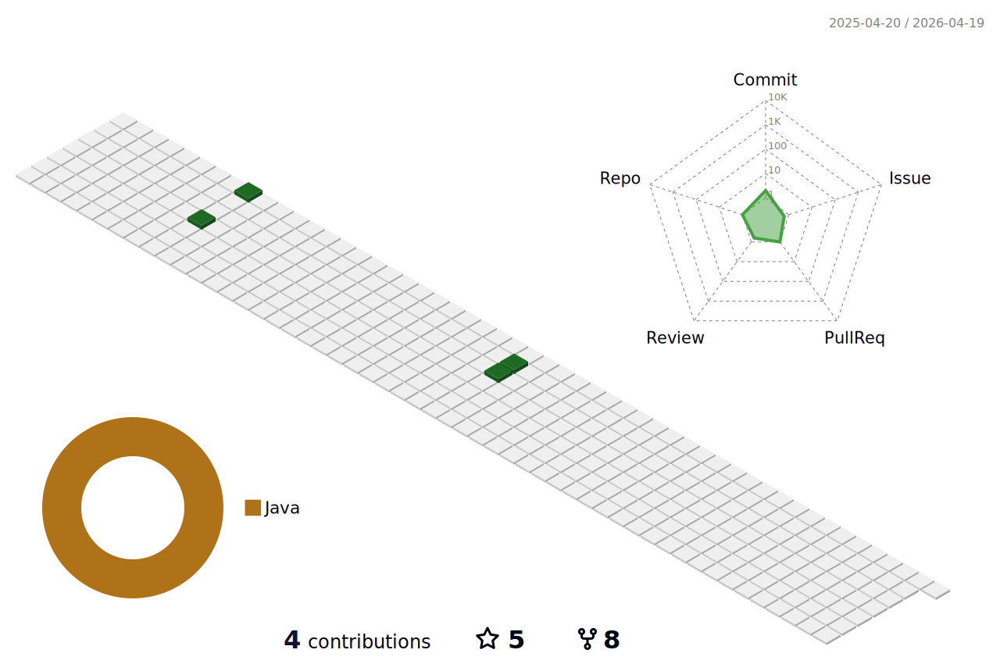

### ♟️ About Me 
---
  👋 안녕하세요. 신입 백엔드 개발자 이승헌입니다.

  - 기록하고 공유하며 함께 성장하는 것을 중요시합니다.
  - [블로그](https://olrlobt.tistory.com/), [깃허브](https://github.com/olrlobt) 활동을 통해 꾸준함을 증명할 수 있습니다.
  - [알고리즘 스터디](https://github.com/SSAFY-10th-Seoul17/algorithm_ssafy), [성능 튜닝이야기 스터디](https://github.com/SSARTEL-10th/JPTS_bookstudy), [이펙티브 자바 스터디](https://github.com/SSARTEL-10th/EffectiveJava_bookstudy)등의 스터디를 통해 전문성을 키우고 있습니다.
  - 문제를 해결해 나가는 과정에서 시도하고, 부딪치며 배우는 것을 선호합니다.

  
  
### 🏃‍♂️Skills
--- 

 

  
 
  

  
      
  
   

### ✍Blog
---  
⚠ `리드미에서 블로그 포스팅 박스 API 제작 & 테스트 중입니다`

  
 

   

### 🙌3D Contributions in the last year
---

  
