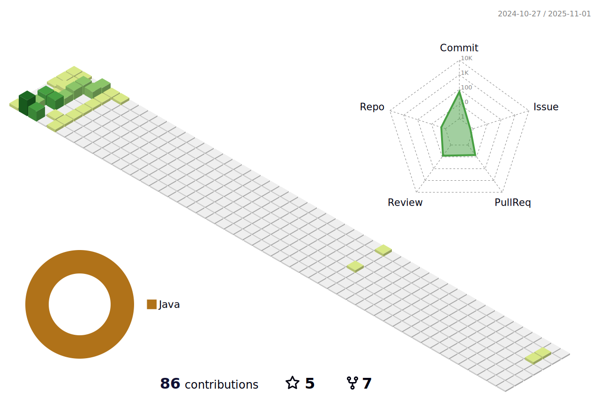

### ♟️ About Me 
---
  👋 안녕하세요. 신입 백엔드 개발자 이승헌입니다.

  - 끊임없이 하는 고민만이 문제를 빠르게 해결할 수 있는 길이라고 생각합니다.
  - 새로운 기술을 사용하거나 도전 하는 것을 좋아합니다.
  - 다른 사람과 의견을 나누는 것을 좋아하고, 누군가에게 도움이 되는 것에 보람을 느껴, 
  기술 블로그를 운영하고 있습니다.

  
  
### 🏃‍♂️Skills
--- 

 

  
  
         
  
   

### ✍Blog
---  

       

### 🙌3D Contributions in the last year
---

  
